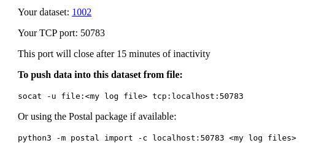

Postal Python API
=================

Overview
--------

The Python API for Postal allows manipulation of data recorded in Postal
programmatically in Python.

Setting up
----------

* Install the `postal` Python package:

```
$ cd python-lib
$ sudo ./setup.py install
```

Authentication is required to access Postal. To remove username and/or password
prompts, a configuration file can be used (`.postal` in ther user's home
directory):

```
$ cat ~/.postal
user = my.username
password = my_secret_password
```

Command-line tool
-----------------

In addition to the API for manipulating data, the `postal` package comes with a
powerful command-line tool that allows importing and exporting of data.

The tool is invoked as follows:

```
$ python3 -m postal
usage: /usr/local/lib/python3.6/dist-packages/postal-2.0-py3.6.egg/postal/__main__.py <command> [<args>]

Available commands are:
   import     Import data into Postal
   export     Export data from Postal
__main__.py: error: the following arguments are required: command
```

### Importing data

#### Supported input

When importing data, one or more of the following files can be passed to the command-line:

* Files with a `.csv` extension.

#### Creating a dataset

The `-C` command-line option request to create a new dataset to import the
data. The description for the dataset can be specified, along with a user name
(defaults to the current login).

Here is an example of simple syntax:

```
$ python3 -m postal import -C 'Test data #1' test_data.csv
```

A project name can be specified in order to restrict access, this can be done
with the `-p` option:

```
$ python3 -m postal import -C 'Restricted test data' -p secret-project test_data.csv
```

A message is output to report the unique identifier of the dataset that was created:

```
Created dataset 1001...
```

#### Importing to an existing dataset

To import data to an existing dataset, the dataset must be actively
recording. This is typically the case right after creation from the Postal web
interface. If the dataset is not actively recording, the "restart" link must be
clicked from the homepage. In both cases, a recording dataset is identified by a
TCP port as reported when creating or restarting the dataset:

> 

This TCP port number can be passed to the `-c` option of the command-line
utility.

```
$ python3 -m postal import -c localhost:50783 test_data.csv
```

### Exporting data

The command-line tool can be used to export selected data from a dataset into a
Comma Separated Values (CSV) file that can be imported into other tools (such as
Excel).

The data to export can be selected by specifying a time interval and a list of
metrics to export.

The example below exports a subset of data from dataset 1001 into the file
`export.csv`. The subset of data is specified by time (the timestamps are epoch
timestamps, see [Epoch Converter](https://www.epochconverter.com/)), and all
metrics with a name matching the Unix shell-style wildcards `test.*` (see
[Fnmatch](https://docs.python.org/3/library/fnmatch.html)).

```
$ python3 -m postal export --start-time 1573507978 --end-time 1573507991 1001 export.csv test.*
```

Additionally, the `-t` option can be used to translate enumeration values into
strings. The `-f` option can be used to filter on validity. See further below
how these options behavior with the API.

Usage of the API
----------------

### Opening a dataset

To open a dataset, use the `PostalRun` object:

```
import postal
run = postal.PostalRun(1001)
```

It is possible to specify a window of time by using the `start_time` and
`end_time` optional arguments, passing an epoch timestamp to only access of
subset of data from the dataset.

### Accessing data

#### Simple time series

The simplest way to access data is by fetching a time series for a given metric:

```
MSFT_stock = run['MSFT']
```

A time series is represented as a `list` of tuples, with the first element of
each tuple the epoch timestamp for the data, and the second element the value
for the metric.

```
>>> MSFT_stock[:3]
[(946684800.0, 39.81), (949363200.0, 36.35), (951868800.0, 43.22)]
```

#### Using data frames

Time series as described above are convenient for inspecting every single value
for a given metric. However, when manipulating several metrics at once, it is
sometimes a problem to iterate over all metrics when some of them have gaps.

The data frames (see
[pandas](https://pandas.pydata.org/pandas-docs/stable/reference/api/pandas.DataFrame.html))
consolidate multiple time series into an iteratable matrix, padding missing
entries as desired.

```
>>> df=postal.DataFrame(run, ['MSFT', 'AAPL'])
>>> df
               MSFT    AAPL
9.466848e+08  39.81   25.94
9.493632e+08  36.35     NaN
9.518688e+08  43.22     NaN
9.545472e+08  28.37     NaN
9.571392e+08  25.45   21.00
...             ...     ...
1.257034e+09  29.27  199.91
1.259626e+09  30.34  210.73
1.262304e+09  28.05  192.06
1.264982e+09  28.67  204.62
1.267402e+09  28.80  223.02

[123 rows x 2 columns]
```

By default, values not available are padded with NaN, however this can be
changed by using the `fillna()` method (see
[`pandas.DataFrame.fillna`](https://pandas.pydata.org/pandas-docs/stable/reference/api/pandas.DataFrame.fillna.html#pandas.DataFrame.fillna). In
the example below, unavailable entries are "forward-filled" (repeating the last
known good value):

```
>>> df.fillna(method='ffill')
               MSFT    AAPL
9.466848e+08  39.81   25.94
9.493632e+08  36.35   25.94
9.518688e+08  43.22   25.94
9.545472e+08  28.37   25.94
9.571392e+08  25.45   21.00
...             ...     ...
1.257034e+09  29.27  199.91
1.259626e+09  30.34  210.73
1.262304e+09  28.05  192.06
1.264982e+09  28.67  204.62
1.267402e+09  28.80  223.02

[123 rows x 2 columns]
```

There are several ways to iterate over a data frame. Here is a simple example:

```
for row in df.itertuples():
    row = row._asdict()
    print(row['Index'], row['MSFT'], row['AAPL'])
```

#### Translation of enumerations

To enable translation of enumerations to strings for all subsequent fetching of
data, the `set_translate()` method can be used.

```
state_raw = run['state']
run.set_translate(True)
state_translated = run['state']
```

As shown in the example, any time series fetched prior to calling the
`set_translate()` method remains unchanged, but any time series fetched after
the call will not contain translated values:

```
>>> state_raw[:3]
[(1589247723.2368002, 0), (1589247724.236901, 1), (1589247725.2367606, 2)]
>>> state_translated[:3]
[(1589247723.2368002, 'Off'), (1589247724.236901, 'Starting'), (1589247725.2367606, 'Started')]
```

There is also a method to retrieve the translations for a given metric:

```
>>> run.get_translation('state')
['Off', 'Starting', 'Started']
```

#### Filtering based on validity

To enable filtering on validity for all subsequent fetching of data, the
`set_filter()` method can be used. Similarly to the tranlation of enumerations
described above, the previously fetched series are unchanged, and only the newly
fetched series are properly filtered.

The filtering that is applied remove all values for which the corresponding
validity metric is not 0.

There is also a method to retrieve the validity metric corresponding to a given
metric:

```
>>> run.get_validity_key('testValue')
'testValueValid'
```

### Accessing metadata

Metadata and annotations are made available through the `PostalRun` object with
the following properties:

* `columns` list all available metrics for the dataset;
* `metadata` contains the raw metadata dictionary, containing enum translation
  and validity map. Note that is is prefered to use the `get_translation()` and
  `get_validity_key()` method instead of using the dictionary directly;
* `annotations` contains the annotations dictionary, indexed by timestamp.

### Creating shareable links

It is possible to programmatically create direct links (share links) to a Postal
plot. The `get_sharelink()` takes a dictionary with the following 3 entries
(unused entries do not have to be specified):

* `left`: specify a list of metrics to plot of the leftmost Y axis;
* `right`: specify a list of metrics to plot of the rightmost Y axis;
* `window`: specify a pair of epoch timestamps to select the period of data to
  plot.

Example:

```
>>> run.get_sharelink({'left': ['MSFT', 'GOOG'], 'right': ['Dow']})
'http://postal.domain.com/view.html?s=9c9e2d38823d4d939357d0c5dcada299'
```
