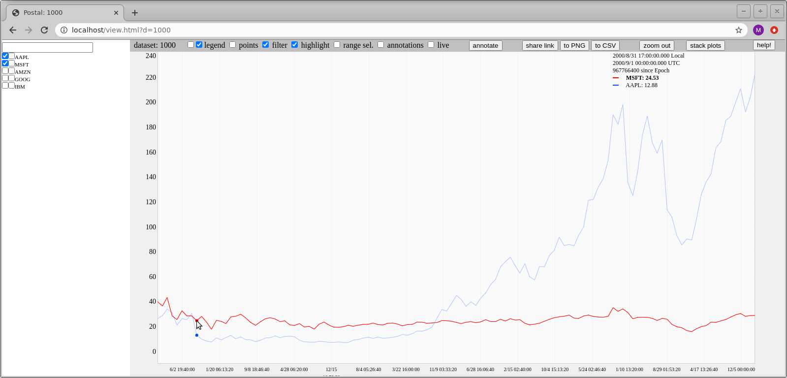
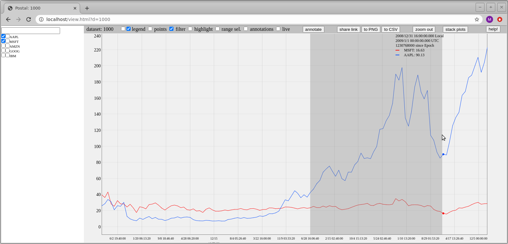
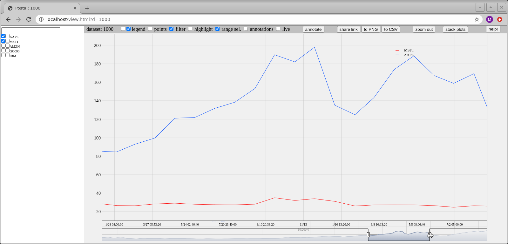

Postal: Help
============

Selecting data to view
----------------------

The pane to the left of the plotting area is used to select the telemetry to
plot. The search bar can be used to filter telemetry metrics by key, using
regular expressions.

When selecting a telemetry metric to plot, the two checkboxes left of the
telemetry key can be used to select the telemetry to plot, and which Y axis to
plot it on. The leftmost checkbox will plot the metric against the left Y axis,
and the rightmost checkbox will plot the metric against the right Y axis.

Using both axes is useful for visualizing two or more metrics simultaneously
even when the order of magnitude of the metrics is vastly different.

Once plotted, a metric can be moved from an axis to the other by selecting the
opposite checkbox. The currently plotted metrics are automatically be moved to
the very beginning of the list in the search pane.

Examining data
--------------

The cursor can be used to examine desired data points. By hovering the cursor
anywhere in the plotting area, the closest data points are highlighted, and
their timestamp and values are displayed in the legend area.

For convenience, both local and UTC times are displayed. The legend can be moved
either left or right of the plotting region or hidden by using the "legend"
checkboxes above the plotting area.

The "points" checkbox can be used to display or hide individual points. This
useful to identify when telemetry is not available.

The "highlight" checkbox can be used to bring forward a specific metric and
make it more visible when several plots tend to be close to each other or
piling up.

The "stack plots" button can be used to create a view where the metrics plotted
against the left Y axis are displayed on top of the metrics plotted against the
right Y axis. This is another way to deconflict many metrics piling up on top of
each other.

The "filter" checkbox can be used to show or hide invalid data points. The
filtering is based on another of the metrics.

To understand which other metric key is used to filter a certain metric, hover
the cursor on the metric name in the left pane.

Zooming and panning
-------------------

Zooming in is achieved by holding down the left mouse button and selecting the
region to zoom into (effectively similar to "swiping" the area to zoom on),
following either the X axis or the Y axis.

Zooming back out to display all the data is achieved by double clicking anywhere
on the plotting area. Alternatively, a progressive zoom out can be achieved by
clicking the "zoom out" button above the plotting area.

Panning can be done by holding the Shift or Alt key while left clicking and
dragging the plot either left or right if zoomed along the X axis, or up or down
if zoomed along the Y axis.

The "range sel." checkbox enables the range selector. The range selector can be
used to perform panning and zooming. The range selector is displayed at te
bottom of the plotting area, and each "handle" can be dragged to select the
range of data to view.

Annotations
-----------

The "annotations" checkbox can be used to display or hide
annotations. Annotations are labels displayed on the plot to mark important
times or events.

The "annotate" button can be used to add a new annotation. A dialog box prompts
to input the text for the new annotation. Once added, annotations can be moved
by dragging the annotation to the desired time. The caption of an annotation can
be modified or the annotation can be deleted.

Each annotations is either locked or unlocked to ensure that it is not
accidentally moved or deleted. After adding an annotation, it is unlocked. Upon
reloading the dataset, all annotations will be initially locked. The "lock" icon
is used to lock or unlock an annotation.

Sharing a view
--------------

The "share link" button takes a snapshot of the current plot and gives a
permalink to it. This permalink contains a unique hash for this plot, and can be
shared to allow others to review the plot while still being able to manipulate
it (as opposed to the "to PNG" button below that takes an immutable picture).

Upon clicking the button, the permalink is automatically copied to the
clipboard.

Exporting data
--------------

The most basic form of export is perform when right clicking on a point. Upon
clicking on a point, its corresponding telemetry key, epoch timestamp, and
instantanous value is copied to the clipboard.

The "to CSV" button can be used to export an Comma Separated Values (CSV) file
of the currenly plotted metrics. The produced file contains exactly what is
displayed.

The "to PNG" button can be used to export an image of the current plotting
area. _Note: this feature does not support capturing the annotations when
creating the image_.

